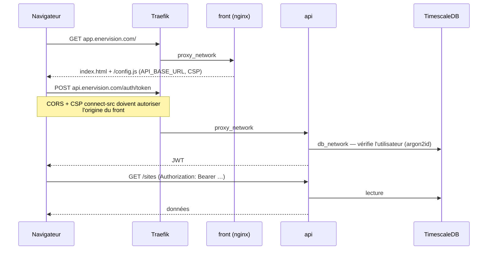
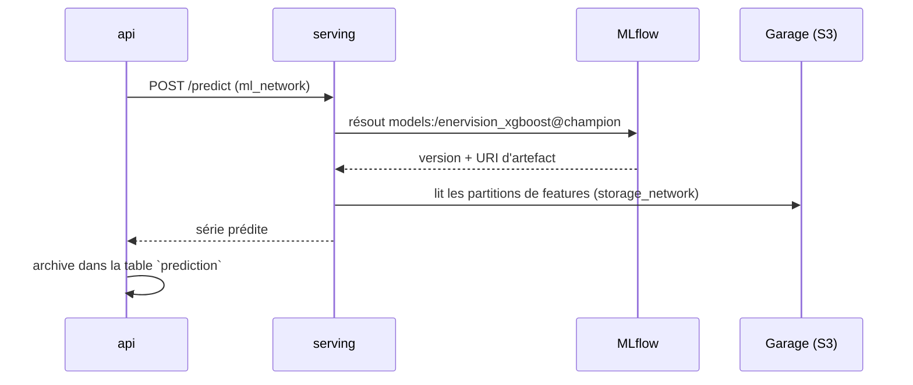
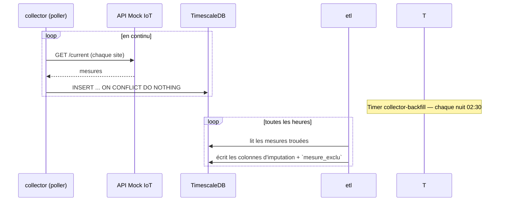
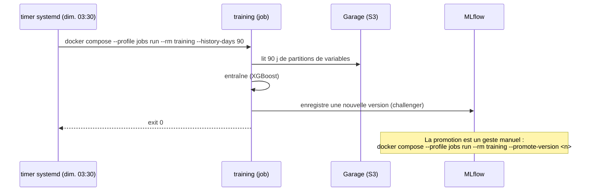

# Flux applicatifs

Comment circule une requête, pour les scénarios principaux. Le détail des
services : [Services › Applications](../services/applications/index.md).

## Consultation du dashboard + appel API

Le navigateur charge le dashboard depuis `app.enervision.com`, puis lit sa
configuration dans `/config.js` (générée au démarrage du conteneur `front`),
et appelle l'API sur son **hôte public** `api.enervision.com` — pas le nom de
conteneur, c'est le poste de l'utilisateur qui émet l'appel.

CORS (côté API) et CSP `connect-src` (côté front) sont **symétriques** : l'un
autorise l'émission de la requête, l'autre la lecture de la réponse. Voir le
[runbook configuration du front](../exploitation/front-config.md).

## Prédiction

L'API délègue l'inférence au service `serving`, qui résout un alias du
registre MLflow et relit les partitions de variables produites par l'ETL sur
Garage.

Si MLflow est injoignable, `serving` **démarre quand même** mais répond
`503` — visible dans son journal et sur sa sonde.

## Ingestion des mesures

Le `collector` (poller) interroge l'API Mock IoT en continu et écrit dans la
table `mesure`. Un timer systemd rejoue chaque nuit une fenêtre glissante
(`--days 2`) pour combler un éventuel trou.

## Réentraînement

Traitement daté, déclenché par un timer systemd hebdomadaire — jamais par un
`docker compose up`.

