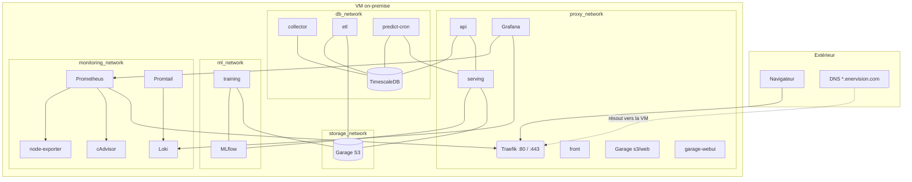

# Architecture

Vue d'ensemble : ce qui tourne, où, et comment les morceaux se parlent.

## Le principe

Tout est conteneurisé, chaque stack a son **projet Docker Compose** déposé
sous `/opt/srv/<stack>/`, et **Traefik** est le seul point d'entrée HTTP. Les
conteneurs se joignent entre eux par des **réseaux Docker externes** partagés,
jamais par des ports publiés sur l'hôte (sauf exceptions d'administration,
liées à la boucle locale).

Ansible génère les `compose.yml` et les `.env` à partir de templates, puis
lance `docker compose up`. **Rien n'est édité à la main sur la VM** : chaque
fichier déployé porte l'en-tête « *ne pas éditer sur l'hôte* ».

## Les stacks

| Stack | Déployée par | Contenu |
|---|---|---|
| **Traefik** | `provision.yml` | routage HTTP, terminaison TLS, métriques |
| **Garage** | `provision.yml` | stockage objet S3 (artefacts ML, features), + endpoint web + UI |
| **TimescaleDB** | `provision.yml` | PostgreSQL + TimescaleDB — la base de la plateforme |
| **Monitoring** | `provision.yml` | Prometheus, Grafana, Loki + Promtail, node-exporter, cAdvisor |
| **Applications** | `deploy.yml` | front, api, mlflow, serving, training, collector, etl, predict-cron |

Détail service par service : [Services](../services/index.md).

## Schéma général

## Ce qu'Ansible fait — et ne fait pas

| Fait | Ne fait pas |
|---|---|
| Créer les réseaux Docker partagés | Installer Docker |
| Déployer et configurer les stacks | Configurer `/etc/docker/daemon.json` (GPU + snapshotter, géré à la main — voir [runbook](../exploitation/docker-daemon.md)) |
| Générer les `.env` depuis le Vault | Gérer les paquets système, SSH, le pare-feu |
| Bootstrapper le layout Garage | Construire les images applicatives (dépôts `dashboard` / `api` / `predict`) |

## Suite

- [L'hôte](hote.md) — la VM et ses contraintes
- [Réseaux Docker](reseaux.md) — les 6 réseaux, qui s'y branche, qui parle à qui
- [Domaines & routage](domaines.md) — la table domaine → service
