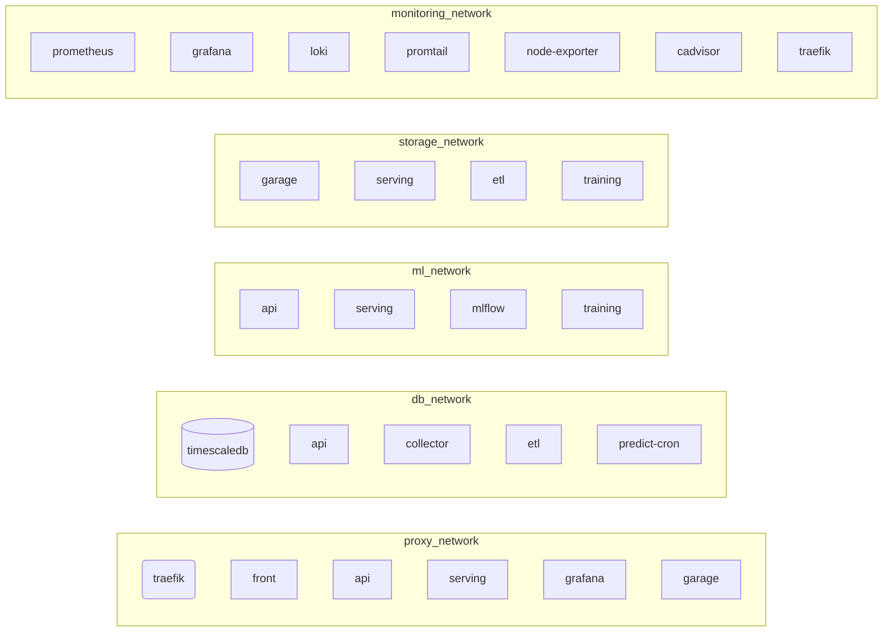

# Réseaux Docker

Les stacks ne se joignent jamais par des ports publiés sur l'hôte, mais par
des **réseaux Docker externes** partagés entre projets Compose.

## Création

Les réseaux sont déclarés dans `docker_external_networks` (`group_vars`) et
créés à deux endroits, tous deux idempotents :

- `provision.yml` — en `pre_tasks`, tag `always` (donc même avec `--tags`
  ciblé, ils existent avant les rôles) ;
- rôle `applications` — au début de `deploy.yml`.

Un projet Compose les référence en `external: true` : il **ne les crée pas**,
il s'y attache.

## Les six réseaux

| Réseau | Rôle | Qui s'y attache |
|---|---|---|
| `proxy_network` | exposition via Traefik | traefik, front, api, serving, grafana, garage, garage-webui, mlflow *(si exposé)* |
| `db_network` | accès à TimescaleDB | timescaledb, api, collector, etl, predict-cron, training |
| `ml_network` | registre MLflow + appels `api ↔ serving` | api, serving, mlflow, training, predict-cron |
| `storage_network` | stockage objet Garage (S3) | garage, serving, etl, training, mlflow *(si artefacts sur `s3://`)* |
| `monitoring_network` | collecte des métriques | prometheus, grafana, loki, promtail, node-exporter, cadvisor, traefik |
| `api_network` | *(réservé)* | — actuellement créé mais aucun service ne l'utilise |

## Schéma

*(un même conteneur apparaît dans plusieurs sous-graphes : il est attaché à
plusieurs réseaux.)*

## Résolution de noms entre projets

Chaque application a son **propre projet Compose** (`enervision-<name>`).
L'alias de service Compose (`front`, `api`…) n'est visible que dans son
projet. D'un projet à l'autre, c'est le **`container_name`** qui résout, sur
le réseau partagé :

| Alias inter-projets | Conteneur |
|---|---|
| `enervision-serving:8000` | service d'inférence |
| `enervision-mlflow:5000` | registre MLflow |
| `timescaledb:5432` | base |
| `garage:3900` | endpoint S3 |

## Dépendances entre conteneurs

Ce qui doit être joignable pour qu'un conteneur fonctionne — utile pour
diagnostiquer un service qui démarre mais ne sert pas.

| Conteneur | Doit joindre | Réseau |
|---|---|---|
| `enervision-api` | `timescaledb:5432`, `enervision-serving:8000` | `db_network`, `ml_network` |
| `enervision-front` | *(rien en interne — le navigateur appelle l'API directement)* | `proxy_network` |
| `enervision-serving` | `enervision-mlflow:5000`, `garage:3900` | `ml_network`, `storage_network` |
| `enervision-mlflow` | `garage:3900` *(si artefacts `s3://`)* | `ml_network`, `storage_network` |
| `enervision-collector-poller` | `timescaledb:5432`, l'API Mock IoT (`MOCK_API_URL`) | `db_network` |
| `enervision-etl` | `timescaledb:5432`, `garage:3900` | `db_network`, `storage_network` |
| `enervision-predict-cron` | `timescaledb:5432`, `enervision-serving:8000` | `db_network`, `ml_network` |
| `training` *(job)* | `timescaledb:5432`, `enervision-mlflow:5000`, `garage:3900` | `db_network`, `ml_network`, `storage_network` |
| `traefik` | le socket Docker (`/var/run/docker.sock`) + tous les conteneurs routés sur `proxy_network` | `proxy_network`, `monitoring_network` |
| `prometheus` | `node-exporter:9100`, `cadvisor:8080`, `traefik:8082` | `monitoring_network` |
| `promtail` | le socket Docker, `loki:3100` | `monitoring_network` |

La matrice réseaux/ports complète : [Référence › Réseaux & ports](../reference/reseaux-ports.md).
