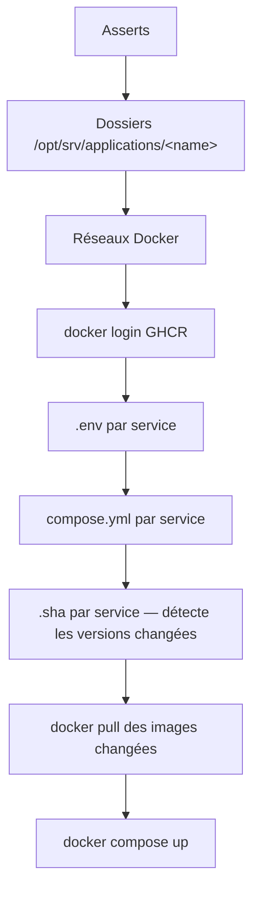

# deploy.yml

Déploie et met à jour les applications. `hosts: application_servers`,
`become: true`, un seul rôle : `applications` — aujourd'hui **front**, **api**
et **collector** (poller Kafka).

```bash
ansible-playbook ansible/playbooks/deploy.yml --ask-vault-pass
```

!!! note "Chaîne ML retirée"
    `serving`, `training`, `etl`, `predict-cron` et leurs timers systemd ont
    été retirés du rôle : la chaîne de prédiction est reconstruite autour de
    Kafka. Il n'y a plus de `kind: job` ni d'unité systemd déposée par ce rôle.

## Déroulé du rôle



### Asserts (bloquants)

| Vérification | Quand |
|---|---|
| `applications_api_jwt_secret` ≥ 32 caractères | `api` activé |
| `applications_api_cors_allowed_origins` non vide, sans `*` | `api` activé |
| `applications_front_csp_connect_src` non vide, sans `*` | `front` activé |
| `applications_front_api_base_url` non vide | `front` activé |
| au moins un service dans `applications_enabled` | toujours |
| chaque service a un `sha` | toujours |
| couple `image:tag` unique | toujours |

### Détection de changement

Le rôle écrit `/opt/srv/applications/<name>/.sha`. Si le contenu change,
`copy` renvoie `changed`, et **seuls les services changés** sont retirés de
GHCR (`docker pull`). `docker compose up` (avec `pull: missing`) tourne
ensuite pour tous les services.

## Mettre à jour une version

1. Récupérer le tag `sha-<git>` publié par le workflow `cd.yml` du dépôt
   (`dashboard`, `api`, `collector`).
2. Éditer la variable dans `group_vars/all/vars.yml` :

    ```yaml
    applications_api_sha: "sha-<git-sha du commit publié>"
    ```

3. Rejouer :

    ```bash
    ansible-playbook ansible/playbooks/deploy.yml --tags applications --ask-vault-pass
    ```

Seul le service dont le SHA a bougé est repull + redéployé.

## Activer / désactiver un service

Éditer `applications_enabled` dans `vars.yml`. Un service retiré n'est plus
configuré ni démarré au prochain run — mais son conteneur en cours n'est
**pas** arrêté par le rôle (`docker compose down` manuel si besoin).

## Vérifications

Les conteneurs `enervision-*` doivent être `Up`. Les endpoints publics
(`api.enervision.com/docs`, `app.enervision.com`, `grafana.enervision.com`)
répondent. Pour le collector : `docker logs enervision-collector` doit montrer
les mesures poussées dans Kafka (visibles aussi dans kafka-ui).
