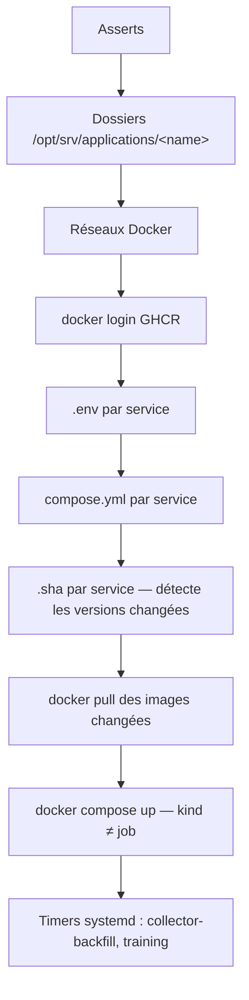

# deploy.yml

Déploie et met à jour les applications. `hosts: application_servers`,
`become: true`, un seul rôle : `applications`.

```bash
ansible-playbook ansible/playbooks/deploy.yml --ask-vault-pass
```

## Déroulé du rôle



### Asserts (bloquants)

| Vérification | Quand |
|---|---|
| `applications_api_jwt_secret` ≥ 32 caractères | `api` activé |
| `applications_api_cors_allowed_origins` non vide, sans `*` | `api` activé |
| clés S3 Garage présentes | `storage_root` en `s3://` **et** un de `serving/training/etl` activé |
| `applications_mlflow_basic_auth_users` non vide | `mlflow` activé **et** `applications_mlflow_expose` |
| `applications_front_csp_connect_src` non vide, sans `*` | `front` activé |
| `applications_front_api_base_url` non vide | `front` activé |
| au moins un service dans `applications_enabled` | toujours |
| chaque service a un `sha` | toujours |
| couple `image:tag` unique (hors `shares_image_with`) | toujours |

### Détection de changement

Le rôle écrit `/opt/srv/applications/<name>/.sha`. Si le contenu change,
`copy` renvoie `changed`, et **seuls les services changés** sont retirés de
GHCR (`docker pull`). `docker compose up` (avec `pull: missing`) tourne
ensuite pour tous les services `kind ≠ job`.

## Mettre à jour une version

1. Récupérer le tag `sha-<git>` publié par le pipeline du dépôt applicatif
   (`dashboard`, `api`, `predict`).
2. Éditer la variable dans `group_vars/all/vars.yml` :

    ```yaml
    applications_api_sha: "sha-<git-sha du commit publié>"
    ```

3. Rejouer :

    ```bash
    ansible-playbook ansible/playbooks/deploy.yml --tags applications --ask-vault-pass
    ```

Seul le service dont le SHA a bougé est repull + redéployé.

!!! note "predict — un commit, plusieurs images"
    `serving`, `training`, `etl` et `collector` sont publiés depuis le même
    dépôt : un même commit leur donne le **même tag** sur des images
    distinctes. Mettre à jour la chaîne predict = bumper les 4 variables au
    même `sha-…`.

## Activer / désactiver un service

Éditer `applications_enabled` dans `vars.yml`. Un service retiré n'est plus
configuré ni démarré au prochain run — mais son conteneur en cours n'est
**pas** arrêté par le rôle (`docker compose down` manuel si besoin). Les
timers systemd, eux, sont bien retirés quand `collector`/`training` sortent
de la liste.

## Timers systemd

| Unité | Déclenche | Calendrier |
|---|---|---|
| `collector-backfill.timer` | rattrapage de la collecte | `*-*-* 02:30:00` |
| `training.timer` | réentraînement | `Sun *-*-* 03:30:00` |

- `systemctl list-timers` montre `collector-backfill.timer` et
  `training.timer` (si `collector` / `training` sont activés) ;
- `systemctl start training.service` force un run hors planning.

## Vérifications

Les conteneurs `enervision-*` doivent être `Up`. Les endpoints publics
(`api.enervision.com/docs`, `app.enervision.com`, `predict.enervision.com/health`,
`grafana.enervision.com`) répondent — voir
[Premier déploiement](premier-deploiement.md), étape 10.
