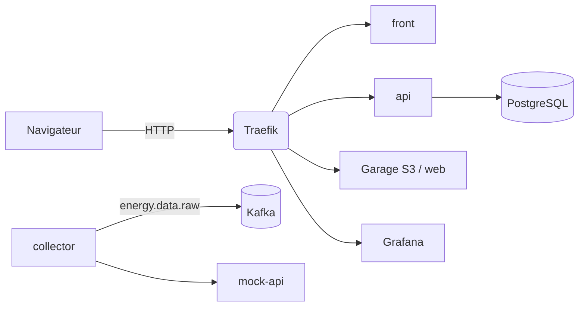

# Infrastructure EnerVision

Documentation technique de la plateforme **on-premise** EnerVision : ce qui
tourne sur la VM, comment c'est déployé, et comment l'exploiter.

## En bref

- Plateforme **intégralement on-premise**, en conteneurs Docker Compose
  derrière **Traefik**, déployée par **Ansible**.
- La VM est fournie **déjà provisionnée** (Docker, GPU, durcissement
  système) : Ansible ne fait que déployer les stacks — jamais les paquets,
  SSH, le pare-feu ni `/etc/docker/daemon.json`.
- **Deux playbooks** :
    - `provision.yml` → réseaux Docker partagés, Traefik, Garage, PostgreSQL,
      Kafka, MLflow, monitoring ;
    - `deploy.yml` → les applications (front, api, et la chaîne predict).
- Les images applicatives sont construites par les pipelines de **leurs
  propres dépôts** (`dashboard`, `api`, `predict`) et publiées sur le GHCR de
  l'organisation, épinglées par **SHA de commit** (`sha-<git>`). L'infra ne
  fait que les consommer.



La chaîne de prédiction (ingester, archiver, Flink, MLflow, inférence) se
reconstruit autour de Kafka — voir [Architecture](architecture/index.md).

## Par où commencer

| Profil | Aller voir |
|---|---|
| Découvrir la plateforme | [Architecture](architecture/index.md) |
| Comprendre un service précis | [Services](services/index.md) |
| Déployer / mettre à jour | [Déploiement](deploiement/index.md) |
| Une valeur précise (port, variable, version…) | [Référence](reference/index.md) |
| Gérer les secrets | [Secrets](secrets/index.md) |

## Lancer cette documentation

```bash
cd docs
docker compose up      # http://localhost:8060
```

Le contenu est dans `docs/content/`, la navigation dans les fichiers
`.nav.yml`. Voir `docs/README.md`.
