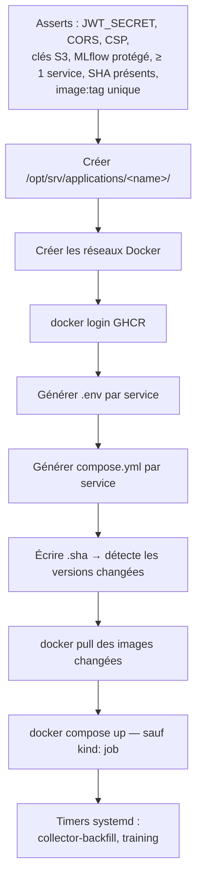

# Applications

Le rôle `applications` (`deploy.yml`) déploie huit services : le dashboard,
l'API, et la chaîne de prédiction (MLflow, serving, training, collector, etl,
predict-cron).

| | |
|---|---|
| Rôle Ansible | `applications` (`deploy.yml`, `hosts: application_servers`) |
| Dossier hôte | `/opt/srv/applications/<name>/` — un par service |
| Projet Compose | `enervision-<name>` |
| Conteneur | `enervision-<name>` (sauf `collector` → `enervision-collector-poller`) |

## Catalogue et activation

`applications_services_catalog` (défauts du rôle) décrit **tous** les services
connus. `applications_enabled` (`vars.yml`) filtre ceux réellement déployés :

```yaml
applications_enabled:
  [front, api, mlflow, serving, training, collector, etl, predict-cron]
```

Un service absent de cette liste n'est **ni configuré, ni tiré, ni démarré**.

## Les `kind`

| `kind` | Signification | Services |
|---|---|---|
| `web` | service HTTP exposé derrière Traefik | front, api, mlflow, serving |
| `worker` | processus long, sans port ni route | collector, etl, predict-cron |
| `job` | traitement daté, **jamais** démarré par `docker compose up` — un timer systemd le lance | training |

## Images et versions

| Service | Image GHCR | SHA |
|---|---|---|
| front | `dashboard` | `applications_front_sha` |
| api | `api` | `applications_api_sha` |
| serving | `predict/serving` | `applications_serving_sha` |
| training | `predict/training` | `applications_training_sha` |
| etl | `predict/etl` | `applications_etl_sha` |
| collector | `predict/collector` | `applications_collector_sha` |
| **mlflow** | *= image `training`* | `shares_image_with: training` |
| **predict-cron** | *= image `api`* | `shares_image_with: api` |

`mlflow` et `predict-cron` n'ont ni image ni version propres : ils
**empruntent** celle d'un autre service et sont exclus du contrôle
d'unicité `image:tag`.

Le dépôt `predict` publie `serving`, `training`, `etl`, `collector` **depuis
le même commit** → même tag, images distinctes. Le rôle vérifie l'unicité du
couple `image:tag`, jamais du SHA seul.

## Ce que fait le rôle, dans l'ordre



Détail dans [Déploiement › deploy.yml](../../deploiement/applications.md).

## Configuration lue de l'environnement

Les images sont **construites une fois par commit** et déployées telles
quelles sur des environnements aux domaines différents. Aucune adresse n'est
figée au build : `api`, `front` et les services predict lisent leur
configuration de leur `.env` (généré par le rôle depuis le Vault et les
variables).

## Les services

- [front](front.md) — le dashboard
- [api](api.md) — l'API métier + `predict-cron`
- [predict](predict.md) — serving, training, mlflow, collector, etl
