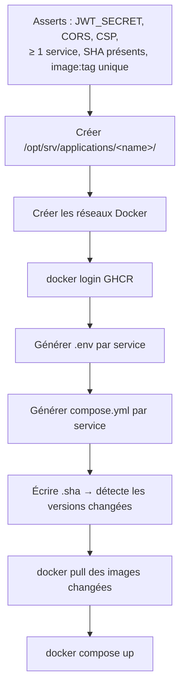

# Applications

Le rôle `applications` (`deploy.yml`) déploie **trois** services : le dashboard,
l'API métier, et le `collector` (poller Kafka).

!!! note "Chaîne ML en reconstruction"
    `serving`, `training`, `etl`, `predict-cron` et l'ancien `collector`
    (predict) ont été retirés du rôle : la chaîne de prédiction est en cours de
    reconstruction autour de Kafka (dépôts `collector`, `ingester`,
    `raw-archiver`, …). Le registre **MLflow** a son propre rôle
    (`provision.yml`) — voir [Services › MLflow](../mlflow.md).

| | |
|---|---|
| Rôle Ansible | `applications` (`deploy.yml`, `hosts: application_servers`) |
| Dossier hôte | `/opt/srv/applications/<name>/` — un par service |
| Projet Compose | `enervision-<name>` |
| Conteneur | `enervision-<name>` |

## Catalogue et activation

`applications_services_catalog` (défauts du rôle) décrit **tous** les services
connus. `applications_enabled` (`vars.yml`) filtre ceux réellement déployés :

```yaml
applications_enabled:
  [front, api]        # collector ajouté dès que applications_collector_sha est renseigné
```

Un service absent de cette liste n'est **ni configuré, ni tiré, ni démarré**.

## Les `kind`

| `kind` | Signification | Services |
|---|---|---|
| `web` | service HTTP exposé derrière Traefik | front, api |
| `worker` | processus long, sans port ni route | collector |

## Images et versions

| Service | Dépôt | Image GHCR | SHA |
|---|---|---|---|
| front | `dashboard` | `dashboard` | `applications_front_sha` |
| api | `api` | `api` | `applications_api_sha` |
| collector | `collector` | `collector` | `applications_collector_sha` |

Chaque image a sa propre version ; le rôle vérifie l'unicité du couple
`image:tag`. Le tag est le `sha-<git-sha>` produit par le workflow `cd.yml` du
dépôt, reporté par PR dans `group_vars` — cf. le README, « Mettre en
production ».

## Ce que fait le rôle, dans l'ordre



Détail dans [Déploiement › deploy.yml](../../deploiement/applications.md).

## Configuration lue de l'environnement

Les images sont **construites une fois par commit** et déployées telles quelles
sur des environnements aux domaines différents. Aucune adresse n'est figée au
build : les trois services (`api`, `front`, `collector`) lisent leur
configuration de leur `.env`, généré par le rôle depuis le Vault et les
variables.

## Les services

- [front](front.md) — le dashboard
- [api](api.md) — l'API métier
- [collector](collector.md) — poller Kafka
